Excel-6

Project Description

Excel-6 is a guide to logical functions in Excel.  Here you'll find practical tips, instructions, and illustrations about working with those functions.

Table of Contents

IF

The IF function checks whether a condition is met, and returns one value if true and another value if false.

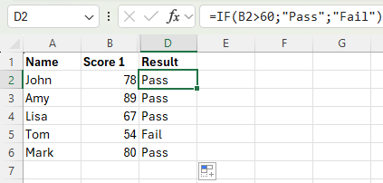

AND

The AND Function returns TRUE if all conditions are true and returns FALSE if any of the conditions are false.

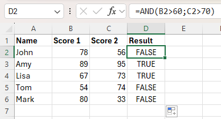

OR

The OR function returns TRUE if any of the conditions are TRUE and returns FALSE if all conditions are false.

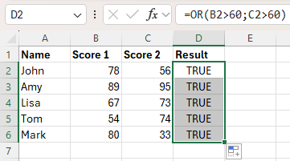

NOT

The NOT function changes TRUE to FALSE, and FALSE to TRUE.

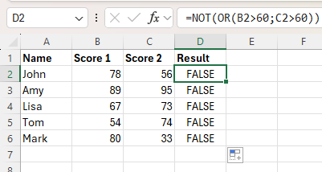

XOR

The XOR function returns TRUE if an odd number of conditions are true, and FALSE otherwise.

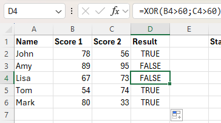

IF with AND example

In this example we check whether start and end values are not empty. Then we subtract them. 
(Note: <> means not equal to)
(Note: If any of the values are empty we leave empty string there.)

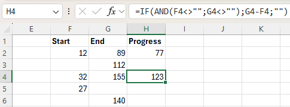

Equal to

= means equal to

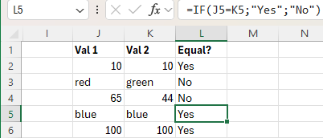

'>' means greater than

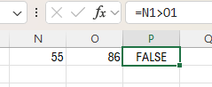

'<' means less than

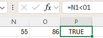

(Note: >= means greater than or equal to, <= means less than or equal to)

IFS

Use the IFS function in Excel 2016 or later when you have multiple conditions to meet. The IFS function returns a value corresponding to the first TRUE condition.

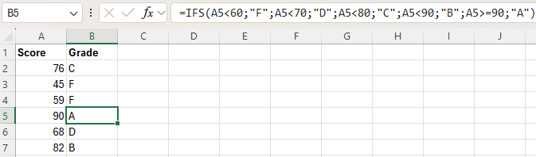

SWITCH

The SWITCH function in Excel looks up a specified value in a list of values and returns the result corresponding to the first match found.

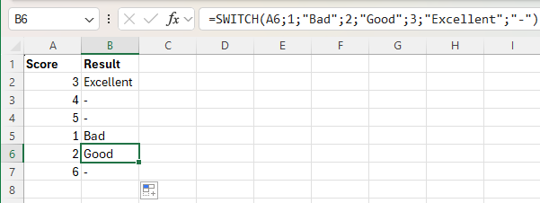

SWITCH example with codes.
(Note: the RIGHT function extracts the 2 rightmost characters from the string)

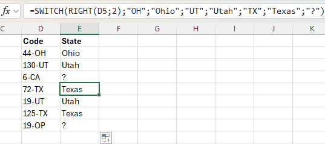
